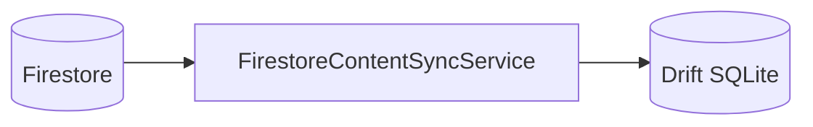

# Firestore 연동 작업 정리 (chusa1817)

이 문서는 **HANJA** 저장소의 Flutter 앱 `flutter/chusa1817`에 적용된 **Firebase / Firestore 연동** 내용을 정리한다. **Firestore 규칙 배포용 Firebase CLI 프로젝트 루트**는 `admin/firestore/`(`firebase.json`, `.firebaserc`, `firestore.rules`)이고, **Python 업로드·클레임 스크립트**는 `admin/python/`에 둔다. 서버 스키마 업로드, 클라이언트 동기화, 빌드 설정을 한곳에서 참고할 수 있도록 한다.

**Firebase `projectId`는 `chusa-1817`**이다. Dart 패키지명·Android `applicationId`의 `chusa1817`과 혼동하지 말 것.

---

## 1. 목적과 아키텍처

- 앱은 스토어 배포 시 **콘텐츠를 번들에 넣지 않고**, 필요 시 **Firestore에서 한자·획·단어/성어**를 받아 **로컬 SQLite(Drift)**에 저장한다.
- **원격 소스**: Cloud Firestore  
- **로컬 캐시**: 기존 `AppDatabase`(Drift)의 `hanja`, `hanja_stroke`, `hanja_word`, `hanja_idiom` 테이블  
- **상태/의존성 주입**: `flutter_riverpod`의 `ProviderScope` + 전용 Provider

데이터 흐름은 다음과 같다.



---

## 2. Flutter 패키지 의존성

`flutter/chusa1817/pubspec.yaml`에 포함된다.

| 패키지           | 역할                          |
|------------------|-------------------------------|
| `firebase_core`  | Firebase 앱 초기화            |
| `firebase_auth`  | 익명 로그인 (`request.auth` 대응) |
| `firebase_app_check` | App Check 토큰 첨부. **Enforce는 Console만** (규칙에 `request.app` 없음) |
| `cloud_firestore`| Firestore 읽기·쿼리           |

버전은 도구 실행 시점에 따라 달라질 수 있으므로 `pubspec.lock`을 기준으로 한다.

### 2.1 App Check 운영 적용 및 API Key 제한

> **상태: 운영 적용 완료.** `firebase_bootstrap.dart`에서 App Check SDK(Play Integrity / DeviceCheck / DebugProvider)가 활성화되어 토큰이 자동 갱신된다.

- **Enforce는 Console에서만 지정**: App Check → APIs → Cloud Firestore → Enforce. API 게이트웨이에서 유효 토큰 없는 요청을 자동 차단한다.
- **`firestore.rules` 보안 규칙**: `request.app`을 규칙에 직접 작성하지 않고 기존 Auth 검증(`allow read: if isSignedIn();`)을 그대로 유지한다.
- **API 키 제한**: GCP Console(`API 및 서비스 > 사용자 인증 정보`)에서 Android(`com.basis.breeze.chusa1817`) 및 iOS 패키지 제한을 적용하여 외부 무단 요청을 방지한다.

---

## 3. 저장소 내 관련 파일 위치

### 3.1 Flutter (앱 코드)

| 경로 | 설명 |
|------|------|
| `flutter/chusa1817/lib/main.dart` | `WidgetsFlutterBinding.ensureInitialized()` → `bootstrapFirebase()` → `ProviderScope`로 앱 실행 |
| `flutter/chusa1817/lib/firebase_options.dart` | `Firebase.initializeApp`용 `DefaultFirebaseOptions` (플레이스홀더; 실제 값은 `flutterfire configure` 권장) |
| `flutter/chusa1817/lib/core/firebase/firebase_bootstrap.dart` | `bootstrapFirebase()` — Core → **App Check** → 익명 로그인; 실패 시에도 앱은 계속 실행 |
| `flutter/chusa1817/lib/core/firebase/firestore_paths.dart` | 컬렉션·문서 ID 상수 (`config/content`, `hanja`, `words`, `strokes` 서브컬렉션명) |
| `flutter/chusa1817/lib/core/firebase/firestore_mappers.dart` | Firestore `Map` → Drift `*Companion` 매핑 |
| `flutter/chusa1817/lib/core/firebase/firestore_content_sync.dart` | `FirestoreContentSyncService` — 페이지 단위 조회 및 DB 반영 |
| `flutter/chusa1817/lib/core/providers/app_providers.dart` | `appDatabaseProvider`, `firebaseFirestoreProvider`, `firestoreContentSyncProvider` |
| `flutter/chusa1817/lib/core/firebase/initial_content_sync.dart` | 기동 직후 로컬 `hanja`가 비어 있을 때만 `syncAllContent()` 1회 |

### 3.2 Android

| 경로 | 설명 |
|------|------|
| `flutter/chusa1817/android/settings.gradle.kts` | `com.google.gms.google-services` 플러그인 선언 (`apply false`) |
| `flutter/chusa1817/android/app/build.gradle.kts` | `id("com.google.gms.google-services")` 적용 |
| `flutter/chusa1817/android/app/google-services.json` | Firebase Android 앱 설정 (플레이스홀더; `flutterfire configure`로 실제 값 권장). **Firebase projectId는 `chusa-1817`**. |

### 3.3 iOS / macOS

- Firebase 콘솔에서 받은 **`GoogleService-Info.plist`**를 Xcode `Runner` 타깃에 추가해야 한다.  
- `firebase_options.dart`의 iOS/macOS 항목이 해당 번들 ID·프로젝트와 일치해야 한다.

### 3.4 `admin/firestore/` (Firebase CLI · 규칙 배포)

| 경로 | 설명 |
|------|------|
| `admin/firestore/firebase.json` | `firestore.rules` 경로 지정. **`admin/firestore` 디렉터리에서** `firebase deploy --only firestore:rules` |
| `admin/firestore/.firebaserc` | 기본 프로젝트 `chusa-1817` (`firebase use` 생략 가능) |
| `admin/firestore/firestore.rules` | 배포용 보안 규칙 |
| `admin/firestore/README.md` | 이 폴더 요약 |
| `flutter/scripts/setup_firebase_flutter.sh` | 로그인·**`admin/firestore`에서 규칙 배포**·`flutterfire configure` (저장소 루트에서 `./flutter/scripts/...`) |

### 3.5 `admin/python/` (Admin SDK 업로드 · 클레임)

| 경로 | 설명 |
|------|------|
| `admin/python/upload_to_firestore.py` | JSON 산출물 → Firestore 일괄 업로드 (Admin SDK) |
| `admin/python/requirements-firebase.txt` | 업로드·클레임 스크립트용 `firebase-admin` |

### 3.6 본 문서

- `admin/firestore/firestore_connect.md` (이 파일)

---

## 4. 앱 시작 시 동작

1. `main()`에서 `WidgetsFlutterBinding.ensureInitialized()` 호출  
2. `bootstrapFirebase()`에서 `Firebase.initializeApp` 후 **`signInAnonymously()`** 로 익명 사용자 확보 (현재 `firestore.rules`가 `request.auth != null`을 요구)  
3. 실패 시: **로그만 출력**하고 앱은 계속 실행  
4. `runApp(ProviderScope(child: HanjaApp()))`  
5. **콘텐츠 동기화**는 기본적으로 **앱 기동 직후·로컬 `hanja` 테이블이 비어 있을 때만** 1회 실행한다. (푸시 알림 후 재동기화·학습 결과 업로드는 별도 설계 예정.) 이때 Firebase 미초기화면 `syncAllContent()`가 실패하고 로그만 남긴다.

**콘솔 설정**: Firebase Console → Authentication → Sign-in method → **익명(Anonymous)** 사용 설정.

---

## 5. Firestore 데이터 모델 (서버 측 계약)

앱의 상수는 `FirestorePaths`에 정의되어 있다.

### 5.1 `config/content` (단일 문서)

| 필드 | 타입 | 필수 | 설명 |
|------|------|------|------|
| `contentVersion` | int (또는 num) | 아니오 | 원격 콘텐츠 버전. 동기화 시작 시 읽어 `ContentSyncResult.remoteContentVersion`에 반영 |
| `activeChangeSession` | map | 아니오 | 로컬 `chusa.db` 의 `sync_sessions` 중 `ACTIVE` 행과 동일 의미(채번 id·설명 등). 앱·관리 도구가 동일 스키마로 맞추면 된다. |
| `dataVersionSnapshot` | map | 아니오 | `_meta/data_version` 과 동일 구조를 **읽기 전용 복제**해 두고, **변경분만 내려받기** 할 때 기준 스냅샷으로 쓸 수 있다(실제 단일 소스는 `_meta/data_version` 권장). |

문서 경로: `config/content` (`FirestorePaths.configContentPath`).

**모델 정리 (저장소 간):**

- Firestore `hanja_basis/{docId}`: 마스터 + ETL·확장 필드를 **한 문서로 확장**한다(과거 `hanja_extend` 전용 필드 흡수).
- Firestore `hanja_extend/{docId}`: **레거시·마이그레이션** 경로. 동일 id 내용은 위 `hanja_basis` 확장 + 로컬 `hanja.origin_note`(JSON) 로 통합 운영한다.
- 로컬 `hanja` 테이블: PK `id` = 권장 문서 id(`H`+16진). `origin_note` 컬럼에 `hanja_extend` 문서 JSON 통째.

### 5.2 컬렉션 `hanja`

- 문서 ID는 **`id` 필드와 동일**하게 두는 것을 권장한다.  
- 필드가 비어 있으면 **문서 ID**를 한자 레코드의 PK로 사용한다 (`resolveHanjaId`).

**한자 필드 → Drift `hanja` 테이블 매핑** (`FirestoreHanjaMapper`):

| Firestore 필드 (우선) | 대체 별칭 | Drift 컬럼 |
|------------------------|-----------|------------|
| `id` | (없으면 문서 ID) | `id` |
| `server_id` | (없으면 문서 ID) | `serverId` |
| `char` | `character` | `character` |
| `reading` | | `reading` |
| `meaning` | | `meaning` |
| `radical` | | `radical` |
| `radical_meaning` | `radicalName` | `radicalName` |
| `stroke_count` | `totalStrokes` | `totalStrokes` |
| `school_level` | `schoolLevel` | `schoolLevel` (`middle` / `high` / `both` 등, 소문자 정규화) |
| `origin_note` | `origin` | `origin` |
| `shape_explanation` | `usageNote` | `usageNote` |
| `sync_revision` | `syncRevision` | `syncRevision` |

동기화 시 `syncStatus`는 `'synced'`로 설정된다.

**획 데이터 (둘 중 하나)**

1. **한자 문서에 임베드**  
   - 필드명: `strokes`  
   - 배열 요소 형식: Python `stroke_entities.json`의 `strokes`와 동일 권장  
     - `order` (1-based 획 순서)  
     - `type` (빈 문자열이면 Drift `direction` 미설정)  
     - `points`: `[[x, y], ...]` (정규화 좌표)  
   - 로컬에서는 `normalizedPoints` 문자열로 직렬화: `"x1,y1;x2,y2;..."`

2. **서브컬렉션** `hanja/{docId}/strokes`  
   - 한자 문서에 `strokes` 배열이 없거나 비어 있을 때, `loadStrokesFromSubcollection == true`이면 조회한다.  
   - 서브문서 필드: `strokeIndex` 또는 `order`, `normalizedPoints` 또는 `points`, `type` / `direction`

획 행 ID: `{hanjaId}_stroke_{strokeIndex}` (0-based index).

### 5.3 컬렉션 `words`

Python `word_entities.json`과 맞춘다.

| 필드 | 설명 |
|------|------|
| `word_id` | 없으면 문서 ID 사용 |
| `word` | 한글 표기(단어/성어 이름) |
| `hanja` | 한자 표기 (성어 등) |
| `meaning` | 뜻 |
| `related_hanja` | 관련 한자 글자 배열 (문자 단위, 예: `["價","格"]`) |
| `entry_type` | `"단어"` → `hanja_word`, `"성어"` → `hanja_idiom` (그 외는 단어로 처리) |

동기화 시:

- 로컬에 이미 적재된 `hanja` 목록으로 **문자 → `hanjaId`** 맵을 만든다 (`character` 기준, 동일 글자는 첫 행 기준).  
- `related_hanja`의 각 글자마다 **별도 행**을 `insertOnConflictUpdate`한다.  
- 행 ID: `{word_id}__{hanjaId}` 형태 (`FirestoreWordMapper`).

---

## 6. 동기화 서비스 API

클래스: `FirestoreContentSyncService`  
생성자: `FirebaseFirestore firestore`, `AppDatabase database`

| 메서드 | 설명 |
|--------|------|
| `Future<int?> fetchRemoteContentVersion()` | `config/content`의 `contentVersion`만 조회 |
| `Future<ContentSyncResult> syncAllContent({ bool loadStrokesFromSubcollection, int hanjaPageSize, int wordsPageSize })` | 한자(및 획) 전부 → 단어/성어 전부 순으로 반영 |

`ContentSyncResult` 필드: `hanjaCount`, `strokeCount`, `wordCount`, `idiomCount`, `remoteContentVersion`.

### 6.1 처리 순서와 성능 주의

1. **Firestore 읽기**와 **SQLite 트랜잭션**을 섞지 않는다.  
   - 각 한자 문서에 대해: 먼저 서브컬렉션 획 등 **네트워크 조회**를 마친 뒤,  
   - `AppDatabase.transaction` 안에서는 **Drift 쓰기만** 수행한다.

2. **페이지네이션**  
   - `hanja`, `words` 모두 `orderBy(FieldPath.documentId)` + `limit` + `startAfterDocument`로 순회한다.  
   - Firestore 단일 필드 `documentId` 정렬만 사용하므로 **복합 인덱스는 불필요**하다.

3. 한자 반영 시 해당 `hanjaId`의 기존 `hanja_stroke` 행은 **삭제 후** 새 획을 넣는다(서버와 로컬 획 목록 일치).

---

## 7. Riverpod Provider

`lib/core/providers/app_providers.dart`

| Provider | 타입 | 설명 |
|----------|------|------|
| `appDatabaseProvider` | `AppDatabase` | 앱당 단일 DB 인스턴스, dispose 시 `close()` |
| `firebaseFirestoreProvider` | `FirebaseFirestore` | `FirebaseFirestore.instance` |
| `firestoreContentSyncProvider` | `FirestoreContentSyncService` | 위 둘을 주입한 동기화 서비스 |

---

## 8. Firestore 호출 시점 (제품 정책)

- **현재**: `InitialContentSync`가 첫 프레임 이후 로컬에 한자가 없으면 `syncAllContent()`를 **백그라운드로 1회** 호출한다. UI 버튼으로의 수동 동기화는 두지 않는다.  
- **추후**: FCM 등 **푸시 수신 핸들러**에서 동일 `FirestoreContentSyncService.syncAllContent()`(또는 증분 API)를 호출하면 된다.  
- **추후**: **교육 결과 업로드**는 Firestore 직접 쓰기보다 Cloud Functions·REST 등 **전용 쓰기 경로**를 두는 편이 안전하다.

---

## 9. 로컬 DB(Drift)와의 관계

- 콘텐츠 테이블 스키마는 `flutter/chusa1817/lib/core/database/tables/content_tables.dart`를 따른다.  
- 사용자 진도(`user_progress` 등)는 한자 `id`를 참조하므로, **한자 문서의 `id`를 안정적으로 유지**하는 것이 중요하다(임의로 문서를 삭제·재생성하면 진도 FK가 깨질 수 있음).

---

## 10. 빌드·설정 체크리스트

1. Firebase 콘솔에서 프로젝트 생성, Android/iOS 앱 등록  
2. `flutter/chusa1817`에서 `flutterfire configure` 실행 → `lib/firebase_options.dart` 갱신  
3. Android: 콘솔에서 받은 `google-services.json`을 `android/app/`에 배치 (`applicationId`와 패키지 일치)  
4. iOS: `GoogleService-Info.plist`를 Runner에 추가  
5. Firestore **보안 규칙**: 콘텐츠는 인증된 사용자(또는 익명) 읽기 전용 등 정책 설정  
6. 위 스키마대로 `config`, `hanja`, `words` 데이터 업로드 (Python `admin/python/output/*.json` → 업로드 스크립트 또는 콘솔/관리 도구)

---

## 11. 보안 규칙 (저장소 파일)

배포본은 **`admin/firestore/firestore.rules`**에 두고, **`admin/firestore` 디렉터리**에서 다음으로 반영한다. (`.firebaserc`에 기본 프로젝트가 있으면 `--project chusa-1817`는 생략 가능.)

```bash
cd admin/firestore
firebase login
firebase deploy --only firestore:rules --project chusa-1817
```

규칙 요지(현재 `firestore.rules` 기준):

- **읽기**: 로그인한 사용자(`request.auth != null`)면 `config`, `hanja`, `hanja/{id}/strokes`, `words`, `hanja_basis`, `hanja_extend`, `hanja_stroke`, `hanja_word`, `_meta/data_version` 등에 **읽기 가능**(Flutter 익명 로그인 포함).
- **쓰기**: 위 경로의 클라이언트 쓰기는 **`request.auth.token.admin == true`**(또는 문자열 `'true'`)인 경우에만 허용. 그 외 클라이언트 쓰기는 거절된다.
- **Admin 웹**(`admin/frontend`): 이메일 로그인 후 동일 조건으로 `hanja_basis` 등에 쓸 수 있다. **일반 사용자 토큰**으로는 `Missing or insufficient permissions`가 난다.
- **Python Admin SDK**(`upload_to_firestore.py` 등)는 규칙을 우회하므로 서비스 계정으로 적재 가능.

---

## 11.1 Admin 웹에서 `hanja_basis` 쓰기가 거절될 때

관리 화면(예: CSV 업로드)에서 아래와 같은 안내가 나오거나, Firestore 오류 메시지에 `permission` / `insufficient permissions`가 포함되는 경우다.

> Firestore가 쓰기를 거절했습니다. ① 이 프로젝트(chusa-1817)에 배포된 규칙에서 hanja_basis 쓰기는 admin 클레임이 필요합니다. ② … ③ …

### 점검 순서

1. **규칙 배포**  
   로컬 `admin/firestore/firestore.rules`가 아직 콘솔에 올라가지 않았거나, 다른 프로젝트에만 배포된 상태일 수 있다. **`admin/firestore` 디렉터리에서** 다음으로 배포한다.  
   `firebase deploy --only firestore:rules --project chusa-1817`  
   (§11 명령과 동일.)

2. **`admin` 커스텀 클레임**  
   Firestore 규칙의 `isAdmin()`은 JWT의 `admin` 클레임을 본다. 해당 **이메일 계정**에 클레임을 넣는다:

   ```bash
   cd admin/python
   pip install -r requirements-firebase.txt
   export GOOGLE_APPLICATION_CREDENTIALS=/Users/yutaek/zWorkSpace/zBasis/.secrets/hanja/chusa-1817-firebase-adminsdk.json
   # (레포 안 admin/firestore/ 에 adminsdk JSON 을 두지 말 것 — admin/firestore/README.md 참고)
   python set_firebase_custom_claims.py --project-id chusa-1817 --email YOUR_EMAIL --admin true
   ```

   클레임을 바꾼 뒤에는 브라우저에서 **로그아웃 후 재로그인**하거나, 관리 앱 **설정 → 인증 · 클레임**에서 **토큰 새로고침**을 눌러 ID 토큰을 갱신해야 한다. 갱신 전 토큰에는 이전 클레임이 남아 있을 수 있다.

3. **웹 앱·프로젝트 일치**  
   `admin/frontend/.env`의 `VITE_FIREBASE_PROJECT_ID` 등이 **반드시 `chusa-1817`**(또는 실제 쓰는 프로젝트)과 같아야 한다. Flutter용·다른 Firebase 프로젝트 키를 넣으면 읽기는 되어도 규칙/데이터가 엇갈리거나 쓰기가 거절될 수 있다.

4. **Authentication**  
   Admin 웹은 **이메일/비밀번호**(또는 사용 중인 로그인 방식)가 Firebase 콘솔에서 사용 설정되어 있어야 한다. 로그인 자체가 안 되면 쓰기 이전 단계에서 막힌다.

5. **콘솔에서 토큰 확인(선택)**  
   브라우저 개발자 도구에서 최신 로그인 후 네트워크/애플리케이션 쪽을 보거나, Firebase Authentication에서 해당 사용자의 커스텀 클레임이 반영됐는지 확인한다.

---

## 12. Python 산출물과의 대응

### 관리 웹「한자 마스터 등록」(순서: `hanja_basis` → `hanja_extend` → `hanja_stroke` → `hanja_word`)

- **형식**: `hanja_basis`(1단계)만 **CSV**(헤더+행). **문서 ID**는 관리 웹 업로드 시 **`한자` 열 첫 글자의 유니코드를 `H`+대문자 16진**(예: `一` → `H4E00`)으로 정규화해 저장하며, 문서 필드 `id`도 동일 값으로 맞춘다. `한자`가 비어 있으면 CSV의 `id` 열 또는 첫 열이 `H[0-9A-F]+` 형태일 때 그 값을 쓰고, 그렇지 않으면 첫 열을 Firestore 안전 ID로 쓴다. **`hanja_extend` · `hanja_stroke` · `hanja_word`(2~4단계)는 원천 데이터 형식이 JSON**(객체의 배열, ETL `output/*.json`과 동일). 관리 웹에서는 해당 JSON을 그대로 올리거나, 동일 필드 구조의 CSV로도 업로드할 수 있다.
- JSON 업로드 시 문서 ID: `hanja_extend`→`id`, `hanja_stroke`→`stroke_data_id`, `hanja_word`→`word_id`. `hanja_stroke`의 `strokes[].points`는 Firestore 제약에 맞게 `[[x,y],…]`→`[{x,y},…]`로 변환된다.

| 로컬 파일(예) | 대상 Firestore 컬렉션 | 비고 |
|---------------|------------------------|------|
| *(별도 기준 CSV)* | `hanja_basis` (1단계) | CSV 전용 |
| **`admin/python/output/hanja_entities.json`** 각 요소 | **`hanja_extend` (2단계)** | **JSON 표준** (`id` = 문서 ID) |
| **`admin/python/output/stroke_entities.json`** 각 요소 | **`hanja_stroke` (3단계)** | **JSON 표준** (`stroke_data_id` = 문서 ID) |
| **`admin/python/output/word_entities.json`** 각 요소 | **`hanja_word` (4단계)** | **JSON 표준** (`word_id` = 문서 ID) |

`hanja_entities`의 `stroke_data_id`는 획 블록(`stroke_entities`)과 묶어 검증·가공할 때 유용하다.

### `upload_to_firestore.py`(서비스 계정, 규칙 우회)

레거시 배포용으로, `hanja_entities.json`을 **`hanja`** 컬렉션에 문서 단위로 쓰고 `stroke_entities`의 `strokes`를 같은 문서에 병합한다. `word_entities.json`은 **`words`** 컬렉션에 쓴다.  
**관리 웹 마스터 등록**과 컬렉션명·형식이 다르므로, 마스터 등록만 사용할 때는 위 표의 **JSON(또는 동일 스키마 CSV)** 경로를 기준으로 한다.

---

## 13. 구현 시 기술 메모

- **이름 충돌**: `cloud_firestore`와 `drift` 모두 `Query` 타입을 노출한다.  
  `firestore_content_sync.dart`에서는 `import 'package:drift/drift.dart' hide Query;`로 Drift 쪽 `Query`를 숨긴다.  
- **위젯 테스트**: `Consumer` 사용으로 `ProviderScope`가 필요하다. `test/widget_test.dart`에서 `ProviderScope(child: HanjaApp())`로 감싼다.  
- **테스트 환경**: `main()`이 테스트에서 호출되지 않으면 Firebase 미초기화일 수 있다. 동기화 버튼을 누르지 않는 한 일반 위젯 테스트는 통과하기 쉽다.

---

## 14. 문제 해결

| 증상 | 점검 |
|------|------|
| `Firebase가 초기화되지 않았습니다` | `bootstrapFirebase()` 성공 여부, `firebase_options`·네이티브 설정 파일 |
| `PERMISSION_DENIED` | Firestore 규칙, `request.auth`, 익명 로그인 여부 |
| Admin 웹 `Missing or insufficient permissions` (hanja_basis 등) | §11.1 참고: 규칙 배포, `admin` 클레임·토큰 갱신, `.env` 프로젝트 ID |
| 획이 비어 있음 | 한자 문서에 `strokes`가 있는지, 서브컬렉션 경로·문서 ID가 `hanja`와 일치하는지 |
| 단어/성어가 안 들어옴 | `related_hanja`의 문자가 로컬 `hanja.character`와 일치하는지(코드포인트·동형자 주의) |
| 페이지네이션 오류 | `orderBy(documentId)` 누락 여부 (`startAfterDocument`와 함께 사용) |

---

## 15. 변경 이력 요약 (문서화 목적)

- Firebase Core / Cloud Firestore 의존성 추가  
- `firebase_options`·Android `google-services`·부트스트랩  
- Firestore 경로 상수, 맵퍼, 전체 동기화 서비스  
- Riverpod Provider 및 `InitialContentSync`(빈 로컬일 때만 초기 동기화)  
- Drift `Query` 숨김 처리 및 위젯 테스트용 `ProviderScope`  

이후 작업으로 **콘텐츠 버전 비교 후 선택적 동기화**, **이메일 등 추가 로그인**, **획 대용량 시 Storage 연동** 등을 이어가면 된다.

---

## 16. Firebase 프로젝트 `chusa-1817` 연결 (로컬에서 할 일)

CI/샌드박스에서는 Firebase CLI 로그인이 불가하므로, **본인 머신**에서 아래를 진행한다.

### 16.1 한 번에 안내

저장소 루트에서:

```bash
./flutter/scripts/setup_firebase_flutter.sh
```

Firebase CLI 미설치 시 안내 메시지에 따라 `brew install firebase-cli` 또는 `npm i -g firebase-tools` 후 재실행.

### 16.2 수동 요약

1. `firebase login`  
2. `cd admin/firestore` 후 `firebase deploy --only firestore:rules --project chusa-1817` (`firebase.json`·`.firebaserc` 사용)  
3. `dart pub global activate flutterfire_cli` 후 `PATH`에 `$HOME/.pub-cache/bin` 추가  
4. `cd flutter/chusa1817` 후 `flutterfire configure --project=chusa-1817 --yes --platforms=android,ios ...` (스크립트와 동일 인자)  
5. Authentication에서 **익명 로그인** 사용  
6. 데이터 업로드:

```bash
cd admin/python
pip install -r requirements-firebase.txt
export GOOGLE_APPLICATION_CREDENTIALS=/Users/yutaek/zWorkSpace/zBasis/.secrets/hanja/chusa-1817-firebase-adminsdk.json
# (레포 안 admin/firestore/ 에 adminsdk JSON 을 두지 말 것 — admin/firestore/README.md 참고)
python upload_to_firestore.py --project-id chusa-1817
```

서비스 계정 JSON은 Git에 넣지 말 것 (`.gitignore`에 패턴 추가됨).
