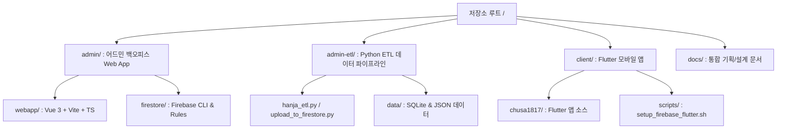

# 루트 저장소 3대 폴더 구조(`admin`, `admin-etl`, `client`) 재편 워크스루

## 1. 개요
저장소 루트 디렉터리의 직관성과 독립적 관리를 위하여 **`admin` (어드민 대시보드 Web App)**, **`admin-etl` (Python 데이터 파이프라인)**, **`client` (Flutter 모바일 클라이언트)**의 3대 독립 탑레벨 디렉터리 체계로 정립하고 관련 명세 및 스크립트를 동기화했습니다.

---

## 2. 탑레벨 디렉터리 체계

| 탑레벨 경로 | 역할 | 주요 구성 |
| :--- | :--- | :--- |
| **`admin/`** | **어드민 백오피스 & 규칙 배포** | `webapp/` (Vue 3 UI), `firestore/` (Rules & CLI) |
| **`admin-etl/`** | **Python 데이터 파이프라인** | Playwright 스크래퍼, SVG 추출기, Firestore 업로더, `data/` |
| **`client/`** | **Flutter 모바일 클라이언트** | `chusa1817/` (Dart App), `scripts/` (설치 CLI), `to-do-list.md` |

---

## 3. 검증 및 빌드 결과

1. **Flutter 클라이언트 앱 테스트 (`client/chusa1817`)**:
   - **`16 / 16 passed`** - 유닛 & 위젯 테스트 100% 통과
2. **어드민 대시보드 Web App 빌드 (`admin/webapp`)**:
   - **`14 / 14 passed`** - Vitest 테스트 100% 통과
   - **`built in 1.03s`** - `vue-tsc` 타입 검사 및 프로덕션 빌드 성공
