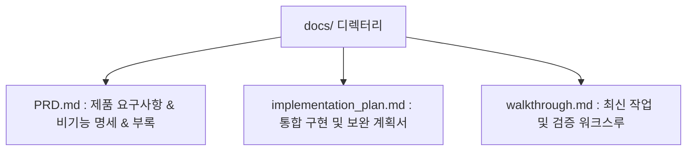

# 문서 구조 단일화 (`docs/`) 워크스루

## 1. 개요
`docs/` 디렉터리 하위의 불필요한 서브 폴더 체계(`impl_plan/`, `work_through/`)를 제거하고, 핵심 명세 및 현황 문서들을 `docs/` 최상위에 단일화하여 접근성과 가독성을 극대화했습니다.

---

## 2. 단일화된 `docs/` 디렉터리 체계

| 문서 파일 | 역할 및 내용 |
| :--- | :--- |
| **[`docs/PRD.md`](file:///Users/yutaek/zWorkSpace/zBasis/HANJA/docs/PRD.md)** | 제품 요구사항, 교육용 1,800자 개정 내역, SM-2 스펙(부록 H), Play Store 출시 스펙(부록 I) |
| **[`docs/implementation_plan.md`](file:///Users/yutaek/zWorkSpace/zBasis/HANJA/docs/implementation_plan.md)** | 시스템 현황 점검, 보완 요소 및 모듈별 작업 계획서 |
| **[`docs/walkthrough.md`](file:///Users/yutaek/zWorkSpace/zBasis/HANJA/docs/walkthrough.md)** | 디렉터리 구조 재편, 검증 결과 및 실행 가이드 |

---

## 3. 검증 결과
- **하위 폴더 삭제**: `docs/impl_plan` 및 `docs/work_through` 서브 폴더 완전히 삭제됨
- **루트 README 링크 갱신**: [`README.md`](file:///Users/yutaek/zWorkSpace/zBasis/HANJA/README.md)의 인덱스 링크가 `docs/implementation_plan.md` 및 `docs/walkthrough.md`를 정확히 가리키도록 업데이트 완료
