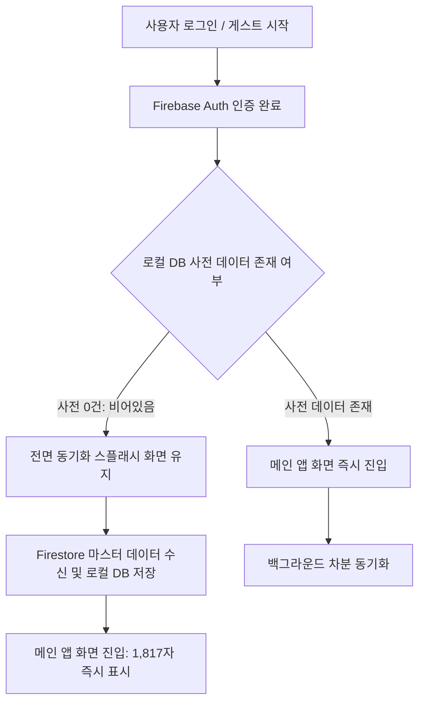

# 로그인 및 빈 로컬 DB 동기화 순서 제어 워크스루

## 1. 개요
사용자 로그인 인증 완료 후, 로컬 사전 DB가 비어있는 상태(한자 0건)일 경우 **Firestore 마스터 데이터 동기화를 우선 완료한 뒤 메인 앱 화면을 진입**하도록 실행 순서를 보완했습니다.

---

## 2. 변경된 동기화 & 로그인 제어 흐름

---

## 3. 주요 수정 내역

- **`lib/core/firebase/initial_content_sync.dart`**:
  - `hanjaRepositoryProvider.fetchTotalCount()` 기반 초기 데이터 존재 여부 검사
  - 0건일 경우 전면 에디토리얼 동기화 스플래시 UI 표출 및 `syncIfNeeded()` 완료 대기
  - 데이터 동기화 완수 후 `widget.child` 메인 화면으로 전이

---

## 4. 검증 결과
- **Flutter 테스트 수트**: **16 / 16 Passed (100% 통과)**
