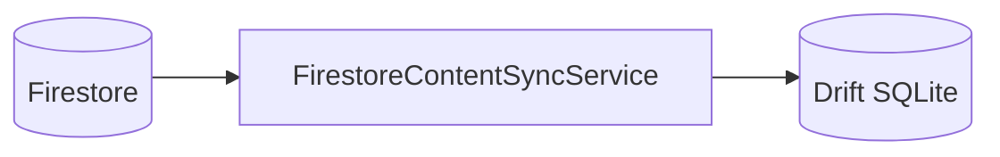

# Firestore 연동 작업 정리 (chusa1817)

이 문서는 **HANJA** 저장소의 Flutter 앱 `flutter/chusa1817`에 적용된 **Firebase / Firestore 연동** 내용을 정리한다. 서버 스키마 업로드, 클라이언트 동기화, 빌드 설정을 한곳에서 참고할 수 있도록 한다.

---

## 1. 목적과 아키텍처

- 앱은 스토어 배포 시 **콘텐츠를 번들에 넣지 않고**, 필요 시 **Firestore에서 한자·획·단어/성어**를 받아 **로컬 SQLite(Drift)**에 저장한다.
- **원격 소스**: Cloud Firestore  
- **로컬 캐시**: 기존 `AppDatabase`(Drift)의 `hanja`, `hanja_stroke`, `hanja_word`, `hanja_idiom` 테이블  
- **상태/의존성 주입**: `flutter_riverpod`의 `ProviderScope` + 전용 Provider

데이터 흐름은 다음과 같다.



---

## 2. Flutter 패키지 의존성

`flutter/chusa1817/pubspec.yaml`에 포함된다.

| 패키지           | 역할                          |
|------------------|-------------------------------|
| `firebase_core`  | Firebase 앱 초기화            |
| `cloud_firestore`| Firestore 읽기·쿼리           |

버전은 도구 실행 시점에 따라 달라질 수 있으므로 `pubspec.lock`을 기준으로 한다.

---

## 3. 저장소 내 관련 파일 위치

### 3.1 Flutter (앱 코드)

| 경로 | 설명 |
|------|------|
| `flutter/chusa1817/lib/main.dart` | `WidgetsFlutterBinding.ensureInitialized()` → `bootstrapFirebase()` → `ProviderScope`로 앱 실행 |
| `flutter/chusa1817/lib/firebase_options.dart` | `Firebase.initializeApp`용 `DefaultFirebaseOptions` (플레이스홀더; 실제 값은 `flutterfire configure` 권장) |
| `flutter/chusa1817/lib/core/firebase/firebase_bootstrap.dart` | `bootstrapFirebase()` — 초기화 실패 시에도 앱은 계속 실행(디버그 로그만) |
| `flutter/chusa1817/lib/core/firebase/firestore_paths.dart` | 컬렉션·문서 ID 상수 (`config/content`, `hanja`, `words`, `strokes` 서브컬렉션명) |
| `flutter/chusa1817/lib/core/firebase/firestore_mappers.dart` | Firestore `Map` → Drift `*Companion` 매핑 |
| `flutter/chusa1817/lib/core/firebase/firestore_content_sync.dart` | `FirestoreContentSyncService` — 페이지 단위 조회 및 DB 반영 |
| `flutter/chusa1817/lib/core/providers/app_providers.dart` | `appDatabaseProvider`, `firebaseFirestoreProvider`, `firestoreContentSyncProvider` |
| `flutter/chusa1817/lib/features/landing/landing_screen.dart` | 「Firestore에서 콘텐츠 받기」 버튼으로 `syncAllContent()` 호출 |

### 3.2 Android

| 경로 | 설명 |
|------|------|
| `flutter/chusa1817/android/settings.gradle.kts` | `com.google.gms.google-services` 플러그인 선언 (`apply false`) |
| `flutter/chusa1817/android/app/build.gradle.kts` | `id("com.google.gms.google-services")` 적용 |
| `flutter/chusa1817/android/app/google-services.json` | Firebase Android 앱 설정 (**현재는 더미 `chusa1817-dev`용**; 실제 프로젝트로 교체 필요) |

### 3.3 iOS / macOS

- Firebase 콘솔에서 받은 **`GoogleService-Info.plist`**를 Xcode `Runner` 타깃에 추가해야 한다.  
- `firebase_options.dart`의 iOS/macOS 항목이 해당 번들 ID·프로젝트와 일치해야 한다.

### 3.4 본 문서

- `firestore/firestore_connect.md` (이 파일)

---

## 4. 앱 시작 시 동작

1. `main()`에서 `WidgetsFlutterBinding.ensureInitialized()` 호출  
2. `bootstrapFirebase()`에서 `Firebase.initializeApp(options: DefaultFirebaseOptions.currentPlatform)` 시도  
3. 실패 시(미설정·테스트 환경 등): 예외를 삼키지 않고 **로그만 출력**하고 앱은 계속 실행  
4. `runApp(ProviderScope(child: HanjaApp()))`  
5. Firestore 동기화는 **사용자가 랜딩의 버튼을 눌렀을 때만** 실행되며, 이때 `Firebase.apps`가 비어 있으면 `FirestoreContentSyncService`에서 `StateError`로 안내한다.

---

## 5. Firestore 데이터 모델 (서버 측 계약)

앱의 상수는 `FirestorePaths`에 정의되어 있다.

### 5.1 `config/content` (단일 문서)

| 필드 | 타입 | 필수 | 설명 |
|------|------|------|------|
| `contentVersion` | int (또는 num) | 아니오 | 원격 콘텐츠 버전. 동기화 시작 시 읽어 `ContentSyncResult.remoteContentVersion`에 반영 |

문서 경로: `config/content` (`FirestorePaths.configContentPath`).

### 5.2 컬렉션 `hanja`

- 문서 ID는 **`id` 필드와 동일**하게 두는 것을 권장한다.  
- 필드가 비어 있으면 **문서 ID**를 한자 레코드의 PK로 사용한다 (`resolveHanjaId`).

**한자 필드 → Drift `hanja` 테이블 매핑** (`FirestoreHanjaMapper`):

| Firestore 필드 (우선) | 대체 별칭 | Drift 컬럼 |
|------------------------|-----------|------------|
| `id` | (없으면 문서 ID) | `id` |
| `server_id` | (없으면 문서 ID) | `serverId` |
| `char` | `character` | `character` |
| `reading` | | `reading` |
| `meaning` | | `meaning` |
| `radical` | | `radical` |
| `radical_meaning` | `radicalName` | `radicalName` |
| `stroke_count` | `totalStrokes` | `totalStrokes` |
| `school_level` | `schoolLevel` | `schoolLevel` (`middle` / `high` / `both` 등, 소문자 정규화) |
| `grade_level` | `grade` | `grade` (문자열이면 첫 정수 추출, 예: `"5급"` → `5`) |
| `origin_note` | `origin` | `origin` |
| `shape_explanation` | `usageNote` | `usageNote` |
| `sync_revision` | `syncRevision` | `syncRevision` |

동기화 시 `syncStatus`는 `'synced'`로 설정된다.

**획 데이터 (둘 중 하나)**

1. **한자 문서에 임베드**  
   - 필드명: `strokes`  
   - 배열 요소 형식: Python `stroke_entities.json`의 `strokes`와 동일 권장  
     - `order` (1-based 획 순서)  
     - `type` (빈 문자열이면 Drift `direction` 미설정)  
     - `points`: `[[x, y], ...]` (정규화 좌표)  
   - 로컬에서는 `normalizedPoints` 문자열로 직렬화: `"x1,y1;x2,y2;..."`

2. **서브컬렉션** `hanja/{docId}/strokes`  
   - 한자 문서에 `strokes` 배열이 없거나 비어 있을 때, `loadStrokesFromSubcollection == true`이면 조회한다.  
   - 서브문서 필드: `strokeIndex` 또는 `order`, `normalizedPoints` 또는 `points`, `type` / `direction`

획 행 ID: `{hanjaId}_stroke_{strokeIndex}` (0-based index).

### 5.3 컬렉션 `words`

Python `word_entities.json`과 맞춘다.

| 필드 | 설명 |
|------|------|
| `word_id` | 없으면 문서 ID 사용 |
| `word` | 한글 표기(단어/성어 이름) |
| `hanja` | 한자 표기 (성어 등) |
| `meaning` | 뜻 |
| `related_hanja` | 관련 한자 글자 배열 (문자 단위, 예: `["價","格"]`) |
| `entry_type` | `"단어"` → `hanja_word`, `"성어"` → `hanja_idiom` (그 외는 단어로 처리) |

동기화 시:

- 로컬에 이미 적재된 `hanja` 목록으로 **문자 → `hanjaId`** 맵을 만든다 (`character` 기준, 동일 글자는 첫 행 기준).  
- `related_hanja`의 각 글자마다 **별도 행**을 `insertOnConflictUpdate`한다.  
- 행 ID: `{word_id}__{hanjaId}` 형태 (`FirestoreWordMapper`).

---

## 6. 동기화 서비스 API

클래스: `FirestoreContentSyncService`  
생성자: `FirebaseFirestore firestore`, `AppDatabase database`

| 메서드 | 설명 |
|--------|------|
| `Future<int?> fetchRemoteContentVersion()` | `config/content`의 `contentVersion`만 조회 |
| `Future<ContentSyncResult> syncAllContent({ bool loadStrokesFromSubcollection, int hanjaPageSize, int wordsPageSize })` | 한자(및 획) 전부 → 단어/성어 전부 순으로 반영 |

`ContentSyncResult` 필드: `hanjaCount`, `strokeCount`, `wordCount`, `idiomCount`, `remoteContentVersion`.

### 6.1 처리 순서와 성능 주의

1. **Firestore 읽기**와 **SQLite 트랜잭션**을 섞지 않는다.  
   - 각 한자 문서에 대해: 먼저 서브컬렉션 획 등 **네트워크 조회**를 마친 뒤,  
   - `AppDatabase.transaction` 안에서는 **Drift 쓰기만** 수행한다.

2. **페이지네이션**  
   - `hanja`, `words` 모두 `orderBy(FieldPath.documentId)` + `limit` + `startAfterDocument`로 순회한다.  
   - Firestore 단일 필드 `documentId` 정렬만 사용하므로 **복합 인덱스는 불필요**하다.

3. 한자 반영 시 해당 `hanjaId`의 기존 `hanja_stroke` 행은 **삭제 후** 새 획을 넣는다(서버와 로컬 획 목록 일치).

---

## 7. Riverpod Provider

`lib/core/providers/app_providers.dart`

| Provider | 타입 | 설명 |
|----------|------|------|
| `appDatabaseProvider` | `AppDatabase` | 앱당 단일 DB 인스턴스, dispose 시 `close()` |
| `firebaseFirestoreProvider` | `FirebaseFirestore` | `FirebaseFirestore.instance` |
| `firestoreContentSyncProvider` | `FirestoreContentSyncService` | 위 둘을 주입한 동기화 서비스 |

---

## 8. UI 진입점

- **랜딩 화면** 하단 「Firestore에서 콘텐츠 받기」  
  - `ref.read(firestoreContentSyncProvider).syncAllContent()`  
  - 진행/완료/실패를 `SnackBar`로 표시  

운영 시에는 온보딩·설정·자동 동기화 등으로 옮기거나, `contentVersion` 비교 후 **필요할 때만** 호출하도록 확장할 수 있다.

---

## 9. 로컬 DB(Drift)와의 관계

- 콘텐츠 테이블 스키마는 `flutter/chusa1817/lib/core/database/tables/content_tables.dart`를 따른다.  
- 사용자 진도(`user_progress` 등)는 한자 `id`를 참조하므로, **한자 문서의 `id`를 안정적으로 유지**하는 것이 중요하다(임의로 문서를 삭제·재생성하면 진도 FK가 깨질 수 있음).

---

## 10. 빌드·설정 체크리스트

1. Firebase 콘솔에서 프로젝트 생성, Android/iOS 앱 등록  
2. `flutter/chusa1817`에서 `flutterfire configure` 실행 → `lib/firebase_options.dart` 갱신  
3. Android: 콘솔에서 받은 `google-services.json`을 `android/app/`에 배치 (`applicationId`와 패키지 일치)  
4. iOS: `GoogleService-Info.plist`를 Runner에 추가  
5. Firestore **보안 규칙**: 콘텐츠는 인증된 사용자(또는 익명) 읽기 전용 등 정책 설정  
6. 위 스키마대로 `config`, `hanja`, `words` 데이터 업로드 (Python `python/output/*.json` → 업로드 스크립트 또는 콘솔/관리 도구)

---

## 11. 보안 규칙 예시 (참고용)

실제 프로젝트의 인증 방식에 맞게 수정해야 한다. 익명 로그인만 쓰는 경우 예시는 다음과 같다.

```
rules_version = '2';
service cloud.firestore {
  match /databases/{database}/documents {
    match /config/{docId} {
      allow read: if request.auth != null;
      allow write: if false;
    }
    match /hanja/{hanjaId} {
      allow read: if request.auth != null;
      allow write: if false;
      match /strokes/{strokeId} {
        allow read: if request.auth != null;
        allow write: if false;
      }
    }
    match /words/{wordId} {
      allow read: if request.auth != null;
      allow write: if false;
    }
  }
}
```

쓰기는 관리자 SDK(Cloud Functions, 로컬 스크립트 등)로만 수행하는 구성을 권장한다.

---

## 12. Python 산출물과의 대응

| 로컬 JSON | Firestore 위치 |
|-----------|----------------|
| `python/output/hanja_entities.json` 각 요소 | `hanja` 컬렉션 문서 1건 (필드명 snake_case 그대로 사용 가능) |
| `python/output/stroke_entities.json` 각 요소의 `strokes` | 해당 한자 문서의 `strokes` 배열로 넣거나, `hanja/{id}/strokes/` 서브문서로 분할 |
| `python/output/word_entities.json` 각 요소 | `words` 컬렉션 문서 1건 |

`hanja_entities`의 `stroke_data_id`는 앱 매퍼에서 직접 쓰지 않지만, 업로드 시 어떤 획 블록과 묶일지 추적하는 데는 유용하다.

---

## 13. 구현 시 기술 메모

- **이름 충돌**: `cloud_firestore`와 `drift` 모두 `Query` 타입을 노출한다.  
  `firestore_content_sync.dart`에서는 `import 'package:drift/drift.dart' hide Query;`로 Drift 쪽 `Query`를 숨긴다.  
- **위젯 테스트**: `Consumer` 사용으로 `ProviderScope`가 필요하다. `test/widget_test.dart`에서 `ProviderScope(child: HanjaApp())`로 감싼다.  
- **테스트 환경**: `main()`이 테스트에서 호출되지 않으면 Firebase 미초기화일 수 있다. 동기화 버튼을 누르지 않는 한 일반 위젯 테스트는 통과하기 쉽다.

---

## 14. 문제 해결

| 증상 | 점검 |
|------|------|
| `Firebase가 초기화되지 않았습니다` | `bootstrapFirebase()` 성공 여부, `firebase_options`·네이티브 설정 파일 |
| `PERMISSION_DENIED` | Firestore 규칙, `request.auth`, 익명 로그인 여부 |
| 획이 비어 있음 | 한자 문서에 `strokes`가 있는지, 서브컬렉션 경로·문서 ID가 `hanja`와 일치하는지 |
| 단어/성어가 안 들어옴 | `related_hanja`의 문자가 로컬 `hanja.character`와 일치하는지(코드포인트·동형자 주의) |
| 페이지네이션 오류 | `orderBy(documentId)` 누락 여부 (`startAfterDocument`와 함께 사용) |

---

## 15. 변경 이력 요약 (문서화 목적)

- Firebase Core / Cloud Firestore 의존성 추가  
- `firebase_options`·Android `google-services`·부트스트랩  
- Firestore 경로 상수, 맵퍼, 전체 동기화 서비스  
- Riverpod Provider 및 랜딩 화면 동기화 버튼  
- Drift `Query` 숨김 처리 및 위젯 테스트용 `ProviderScope`  

이후 작업으로 **콘텐츠 버전 비교 후 선택적 동기화**, **Firebase Auth(익명/이메일)**, **획 대용량 시 Storage 연동** 등을 이어가면 된다.
